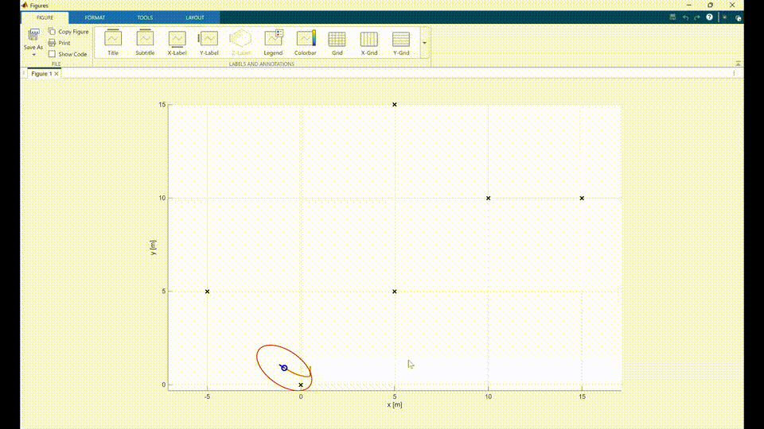
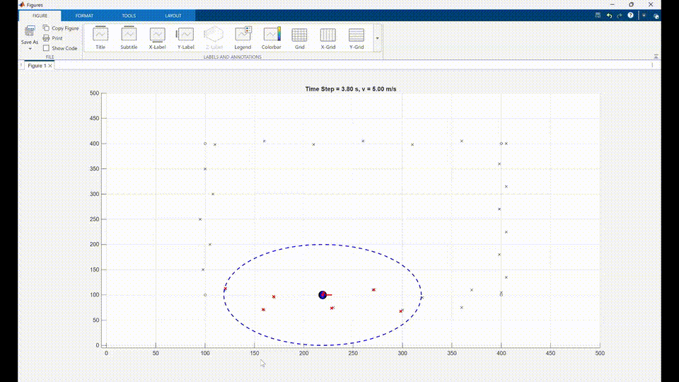
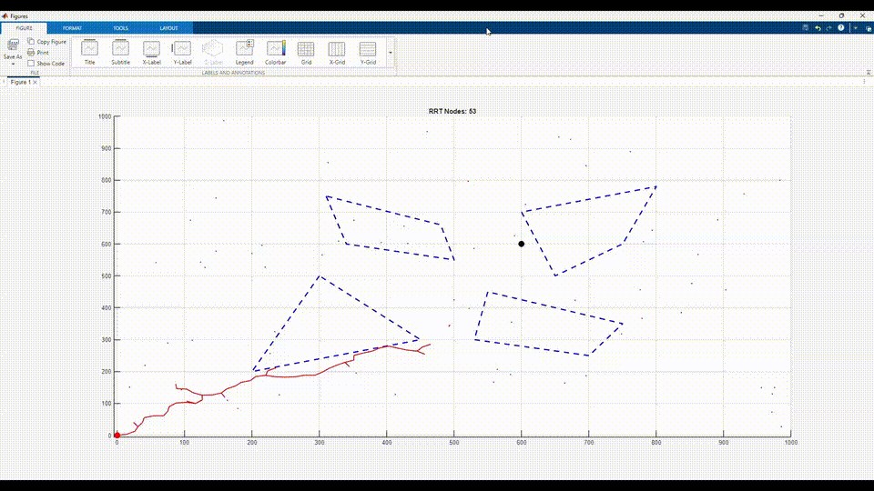
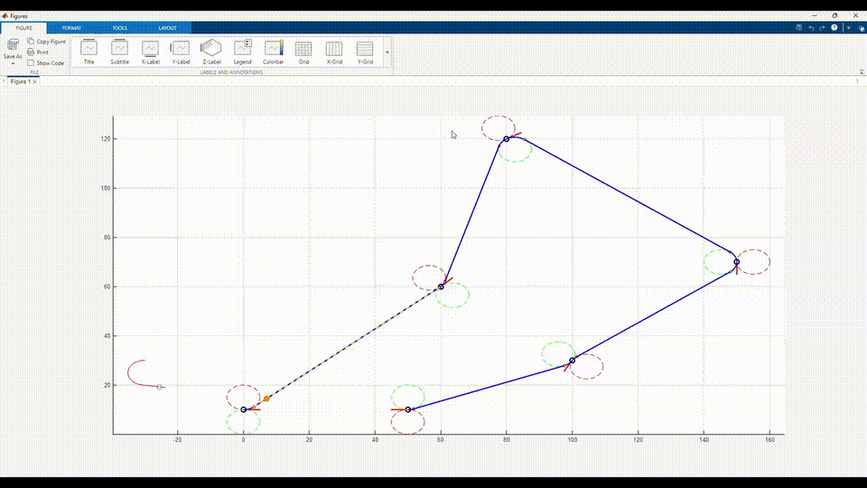

# Autonomous Navigation and Tracking

[English Version](README_en.md)

一个基于 MATLAB 的移动机器人自主导航实验项目，覆盖定位、建图、路径规划与路径跟踪流程。项目整合了 EKF landmark-based localization、粒子滤波 SLAM、RRT 全局路径规划、shortcut 路径优化、Dubins 曲线路径生成和 Carrot-Chasing 路径跟踪控制等模块。

完整报告：[Autonomy_482348_Longlong Wang.pdf](Results/Autonomy_482348_Longlong%20Wang.pdf)

## 演示与结果

以下 GIF 用于展示各模块的运行效果。完整视频和报告文件保存在 `Results/` 目录中。

| 模块 | GIF 预览 | 完整视频 | 内容 |
| --- | --- | --- | --- |
| EKF Localization | [GIF](Results/ekf_localization.gif) | [MP4](Results/ekf_localization.mp4) | 基于 landmark range-bearing 观测的机器人位姿估计 |
| Particle Filter SLAM | [GIF](Results/particle_slam.gif) | [MP4](Results/Particle_slam.mp4) | 粒子滤波 SLAM、landmark 建图、权重更新与重采样 |
| RRT + Dubins Planning | [GIF](Results/rrt_dubins_planning.gif) | [MP4](Results/rrt_dubins_cca.mp4) | RRT 避障路径搜索、shortcut 优化与 Dubins refinement |
| Dubins Tracking | [GIF](Results/dubins_tracking.gif) | [MP4](Results/dubins_path_tracking_doublespeed.mp4) | Dubins path 生成与 Carrot-Chasing 路径跟踪 |

### EKF Localization

该模块使用已知 landmark 的 range-bearing 观测对机器人位姿 `[x, y, theta]` 进行 EKF 估计，并通过 innovation、NIS 和状态协方差分析滤波表现。



### Particle Filter SLAM

该模块实现 FastSLAM-style 粒子滤波建图流程。每个 particle 保存自身位姿、权重和 landmark map，并根据观测似然更新权重，在有效粒子数下降时触发重采样。



### RRT + Dubins Planning

该模块在多边形障碍环境中使用 RRT 搜索可行路径，通过 shortcut 删除冗余节点，再使用 Dubins 曲线将折线路径转换为满足最小转弯半径约束的可跟踪轨迹。



### Dubins Tracking

该模块基于 waypoint pose 生成 Dubins path，并使用 Carrot-Chasing 方法进行车辆路径跟踪仿真。



## 功能特性

- 基于 landmark range-bearing 观测的 EKF 位姿估计。
- 支持 single-landmark 与 multi-landmark 更新模式对比。
- 使用 innovation statistics、NIS consistency 和 state uncertainty 分析滤波稳定性。
- 实现 FastSLAM-style 粒子滤波建图流程。
- 支持 landmark 初始化、数据关联、权重更新、`N_eff` 监控和重采样。
- 使用 RRT 在多边形障碍环境中进行全局路径搜索。
- 通过 shortcut 优化删除 RRT 路径中的冗余节点。
- 使用 Dubins 曲线生成满足最小转弯半径约束的路径。
- 使用 Carrot-Chasing 方法完成非完整约束车辆的路径跟踪仿真。

## 技术栈

- MATLAB
- Extended Kalman Filter
- Particle Filter / FastSLAM-style SLAM
- Landmark-based Localization
- Range-Bearing Measurement Model
- RRT Path Planning
- Dubins Path
- Carrot-Chasing Path Following

## 项目结构

```text
.
|-- ekf_localization/
|   |-- main.m
|   |-- analysis_innovation.m
|   |-- analysis_NIS.m
|   |-- analysis_P.m
|   |-- animate_ekf.m
|   `-- data/
|-- particle_slam/
|   |-- main.m
|   |-- +particles/
|   |-- +perception/
|   |-- +map_manage/
|   |-- +control/
|   |-- +calculate/
|   |-- +visualise/
|   `-- +common/
|-- rrt_dubins_planning/
|   |-- main.m
|   |-- +path_planning/
|   |   |-- +rrt/
|   |   `-- +dubins/
|   |-- +path_following/
|   |-- +common/
|   `-- +data/
|-- dubins_tracking/
|   |-- main.m
|   |-- +path_planning/
|   |-- +path_following/
|   |-- +data/
|   `-- debug/
|-- Results/
`-- README.md
```

## 模块说明

### EKF Localization

路径：

```text
ekf_localization/
```

该模块用于已知 landmark 地图下的机器人位姿估计。输入为控制量和 landmark 的 range-bearing 测量，输出为机器人状态估计轨迹和协方差演化。

主要内容：

- 非线性运动模型预测。
- range-bearing 观测模型更新。
- single-landmark / multi-landmark 更新模式对比。
- Kalman gain 与 Joseph form 协方差更新。
- innovation 均值、标准差分析。
- NIS 一致性检验。
- 状态不确定性曲线与协方差椭圆可视化。

主要文件：

```text
ekf_localization/main.m
ekf_localization/analysis_innovation.m
ekf_localization/analysis_NIS.m
ekf_localization/analysis_P.m
ekf_localization/animate_ekf.m
```

### Particle Filter SLAM

路径：

```text
particle_slam/
```

该模块实现一个 FastSLAM-style 粒子滤波 SLAM demo。每个粒子维护自己的机器人位姿、权重和 landmark map。系统根据传感器观测进行 landmark 初始化、数据关联、局部 EKF 更新和粒子权重更新。

主要内容：

- 粒子状态预测与过程噪声注入。
- range-bearing landmark 测量模拟。
- landmark 初始化与协方差计算。
- 基于 Mahalanobis distance 的数据关联。
- 已匹配 landmark 的 EKF-style 更新。
- 粒子权重归一化与 measurement likelihood 更新。
- `N_eff` 监控与低有效粒子数重采样。
- landmark washing，用于合并或清理重复 landmark。
- 粒子误差、有效粒子数和 landmark association 统计分析。

主要文件：

```text
particle_slam/main.m
particle_slam/+particles/state_prediction.m
particle_slam/+particles/initialize_landmark.m
particle_slam/+perception/sensor_measurement.m
particle_slam/+map_manage/recheck_new_landmark.m
particle_slam/+map_manage/landmark_washing.m
particle_slam/+visualise/N_eff_particle.m
particle_slam/+visualise/particle_error.m
particle_slam/+visualise/landmark_association_anaysis.m
```

### RRT + Dubins Planning

路径：

```text
rrt_dubins_planning/
```

该模块实现从全局路径搜索到可跟踪轨迹生成的流程。首先使用 RRT 在障碍环境中搜索路径，然后通过 shortcut 优化减少中间节点，最后将路径转换为 Dubins 分段轨迹，并调用 Carrot-Chasing 进行跟踪仿真。

流程：

```text
RRT search -> path backtracking -> shortcut optimization -> Dubins refinement -> Carrot-Chasing tracking
```

主要内容：

- 多边形障碍物地图构建。
- RRT 随机采样、最近节点搜索和固定步长扩展。
- 线段与多边形障碍物碰撞检测。
- 从 RRT tree 中回溯生成原始路径。
- shortcut 路径优化。
- Dubins refinement，使路径满足最小转弯半径约束。
- Carrot-Chasing 路径跟踪仿真。

主要文件：

```text
rrt_dubins_planning/main.m
rrt_dubins_planning/+path_planning/+rrt/rrt.m
rrt_dubins_planning/+path_planning/+rrt/chk_collision.m
rrt_dubins_planning/+path_planning/+rrt/rrt_path_build.m
rrt_dubins_planning/+path_planning/+rrt/rrt_shortcut_opt.m
rrt_dubins_planning/+path_planning/+dubins/dubins_path.m
rrt_dubins_planning/+path_following/carrot_chasing.m
```

### Dubins Tracking

路径：

```text
dubins_tracking/
```

该模块实现 Dubins path 生成与路径跟踪。输入为多个 waypoint pose，每个 pose 包含位置和朝向。系统计算左右转圆心，生成 CSC 候选路径并选择最短路径，再使用 Carrot-Chasing 进行轨迹跟踪。

支持的 Dubins 候选类型：

```text
LSL, RSR, LSR, RSL
```

主要内容：

- 左/右转圆心计算。
- CSC 类型 Dubins 候选路径生成。
- 切点、圆弧和直线段计算。
- 最短 Dubins 路径选择。
- Dubins path 可视化。
- Carrot-Chasing 路径跟踪。

主要文件：

```text
dubins_tracking/main.m
dubins_tracking/+path_planning/calc_circle_centre.m
dubins_tracking/+path_planning/CSC.m
dubins_tracking/+path_planning/dubins_path_planning.m
dubins_tracking/+path_planning/draw_dubins_path.m
dubins_tracking/+path_following/carrot_chasing.m
```

## 运行方法

### 1. 打开 MATLAB

进入总项目目录：

```matlab
cd('D:\Workspace\autonomous-navigation-matlab')
```

### 2. 运行 EKF Localization

```matlab
cd('D:\Workspace\autonomous-navigation-matlab\ekf_localization')
main
```

### 3. 运行 Particle Filter SLAM

```matlab
cd('D:\Workspace\autonomous-navigation-matlab\particle_slam')
main
```

### 4. 运行 RRT + Dubins Planning

```matlab
cd('D:\Workspace\autonomous-navigation-matlab\rrt_dubins_planning')
main
```

### 5. 运行 Dubins Tracking

```matlab
cd('D:\Workspace\autonomous-navigation-matlab\dubins_tracking')
main
```

## 与简历项目的对应关系

该仓库对应简历中的：

```text
Autonomous Navigation and Tracking | Autonomy
```

项目覆盖移动机器人自主导航中的几个核心模块：

```text
Localization -> SLAM -> Global Planning -> Path Refinement -> Path Following
```

可对应描述为：

- 使用 EKF 处理基于 landmark 观测的机器人位姿估计，比较 single-landmark 与 multi-landmark 更新效果。
- 通过 innovation statistics、NIS consistency 和 state uncertainty 评估滤波稳定性。
- 实现 FastSLAM-style 粒子滤波建图流程，包括 landmark 初始化、数据关联、权重更新、`N_eff` 监控与重采样。
- 使用 RRT 在多边形障碍环境中进行全局路径搜索，并通过 shortcut 删除冗余节点。
- 基于 Dubins 曲线将路径转换为满足最小转弯半径约束的可跟踪轨迹，并使用 Carrot-Chasing 完成路径跟踪仿真。

## 注意事项

- 本仓库是多个 MATLAB autonomy 实验的整理版本，不是完整生产级自动驾驶系统。
- `ekf_localization` 假设 landmark 位置已知，因此更准确地说是 landmark-based localization，不是 SLAM。
- `particle_slam` 中每个 particle 维护自己的 landmark map，更接近 FastSLAM-style demo。
- Dubins path 当前主要实现 CSC 类型候选路径：`LSL`、`RSR`、`LSR`、`RSL`。
- RRT 为基础 RRT 实现，不是 RRT*。
- 部分模块最初是独立实验项目，当前已按功能整理到统一仓库中。
